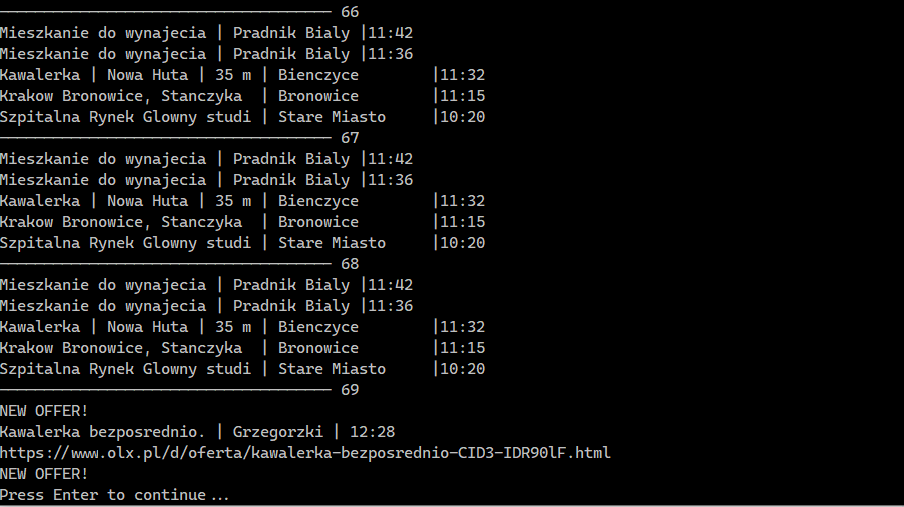

## Description

The code monitors OLX ads and displays new ones.



## Installation

Requires only installation of the following modules:
- bs4
- unidecode
- datetime
- re
- requests
- time
- winsound

Install the modules with:
```bash
pip install $MODULE
```

## Usage

All necessary parameters are stored in the **config.ini** file.

Set the following parameters:
- **OlxSearchPageUrl** - search page url with all specified filters and sorting type (change ***%*** to ***%%*** !)
- **Sound** - path to the alarm sound
- **LastOffersAmount** - number of viewed offers
- **TimeWindowNewOffers** - time period within which new offers are displayed (in minutes)
- **TimeWindowLastOffers** - time period within which all offers are displayed (in minutes)
- **HoursCorrection** - time zone correction depending on the user's location (in hours)
- **RepeatDelay** - delay between page updates (without code running time) (in seconds)

### Just run the code and reap the harvest!

The script runs indefinitely, so to terminate it, just stop the execution.

## Contributing
Pull requests are welcome. For major changes, please open an issue first to discuss what you would like to change.

Please make sure to update tests as appropriate.

## License
[MIT](https://choosealicense.com/licenses/mit/)